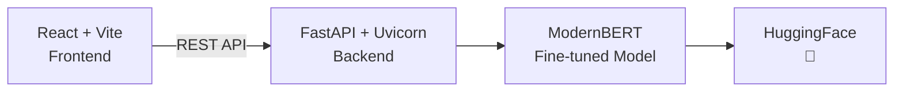

<p align="center">
  
</p>

<p align="center">
  <i>AI-powered sentiment analysis that actually slaps</i>
</p>

<br />

<div align="center">

[](https://huggingface.co/)
[](https://react.dev/)
[](https://fastapi.tiangolo.com/)
[](https://www.python.org/)
[](https://vite.dev/)

<br />

> [!TIP]
> **Drop a comment. Get the vibe. Instantly.** ✨

Classify thousands of comments into **Positive** / **Negative** / **Neutral** — powered by a fine-tuned ModernBERT transformer with >90% accuracy.

<br />

</div>

---

<br />

## 📑 Table of Contents

- [✨ Features](#-features)
- [🏗️ Architecture](#️-architecture)
- [🛠️ Tech Stack](#️-tech-stack)
- [🤖 Models](#-models)
- [🚀 Quick Start](#-quick-start)
- [🔌 API Reference](#-api-reference)
- [📈 Performance](#-performance)
- [⚙️ How It Works](#️-how-it-works)
- [📂 Supported Files](#-supported-files)
- [📁 Project Structure](#-project-structure)
- [📜 License](#-license)

---

<br />

## ✨ Features

<details>
<summary><b>Click to expand all features</b></summary>

| | Feature | Description |
|---|---|---|
| ✍️ | **Single Comment** | Type or paste any comment → instant sentiment + confidence breakdown |
| 📁 | **Bulk Upload** | Drag & drop `.csv`, `.txt`, `.xlsx` (10MB / 5,000 rows max) |
| 📊 | **Real-time Results** | Animated cards with color-coded labels & confidence bars |
| 📋 | **Batch Table** | Paginated, searchable, filterable results |
| ⬇️ | **CSV Export** | One-click download of all classified results |
| 🔄 | **Mode Toggle** | Seamless switch between text input & file upload |
| ⚡ | **Blazing Fast** | <200ms/comment on GPU, <2s on CPU |
| 🎨 | **Dark Glassmorphism** | Sleek UI that looks like it costs $50K |
| 🧪 | **Sentiment** | Positive, Neutral, Negative with confidence scores |
| 📝 | **Comment Type** | Praise, Complaint, Question, Feedback, Spam, Other |
| ☠️ | **Toxicity** | Scores abusive/harmful language 0–100% |
| 🎭 | **Emotions** | 28 fine-grained emotions (joy, anger, curiosity, gratitude…) |
| 😏 | **Sarcasm** | Catches ironic positivity & flips sentiment |
| 🔍 | **Word Highlighting** | Color-coded words by individual sentiment |
| 📖 | **Multi-sentence** | Detects mixed sentiment across sentences |
| 🚫 | **Gibberish Filter** | Rejects keyboard mashing & numeric spam |
| 🗣️ | ** Informal English** | Handles slang, contractions, emojis |

</details>

---

<br />

## 🏗️ Architecture



```
┌─────────────────┐         ┌─────────────────────┐
│                 │  REST   │                     │
│   React + Vite  │ ◄─────► │  FastAPI + Uvicorn  │
│   (Frontend)    │  API    │    (Backend)        │
│                 │         │                     │
└─────────────────┘         └────────┬────────────┘
                                      │
                             ┌────────▼────────────┐
                             │                     │
                             │  ModernBERT (2024)  │
                             │  Fine-tuned Model   │
                             │  HuggingFace 🤗     │
                             │                     │
                             └─────────────────────┘
```

---

<br />

## 🛠️ Tech Stack

| Layer | Technologies |
|:---:|:---|
| 🖥️ **Frontend** | React 19 · Vite 8 · Axios · Recharts · Lucide Icons · Framer Motion |
| ⚙️ **Backend** | FastAPI · Python 3.11 · Uvicorn (ASGI) |
| 🧠 **ML/AI** | ModernBERT-base (fine-tuned) · HuggingFace Transformers · PyTorch |
| 📄 **File Parsing** | PapaParse (CSV) · SheetJS (XLSX) · pandas + openpyxl |
| 🚀 **Deploy** | Vercel / Netlify (FE) · Render / HF Spaces (BE) |

---

<br />

## 🤖 Models

| Model | Task | Parameters |
|:---|:---:|:---:|
| `cardiffnlp/twitter-roberta-base-sentiment-latest` | Sentiment | 125M |
| `unitary/toxic-bert` | Toxicity | 110M |
| `facebook/bart-large-mnli` | Comment Type (zero-shot) | 400M |
| `SamLowe/roberta-base-go_emotions` | Emotions (28 classes) | 125M |
| `cardiffnlp/twitter-roberta-base-irony` | Sarcasm/Irony | 125M |
| VADER Lexicon | Word-level Sentiment | Rule-based |

> 📦 First run downloads ~1.5 GB of model weights, cached locally after.

---

<br />

## 🚀 Quick Start

### Prerequisites

- **Node.js** 18+
- **Python** 3.11+
- **pip** / **venv**

### 1. Clone the Repository

```bash
git clone https://github.com/your-repo/smart-comment-classification.git
cd smart-comment-classification
```

### 2. Start the Backend

```bash
cd backend
python -m venv venv
# Windows
venv\Scripts\activate
# macOS/Linux
source venv/bin/activate

pip install -r requirements.txt
uvicorn main:app --reload
```

> 🖥️ Backend runs on [`http://localhost:8000`](http://localhost:8000)  
> ⏱️ First startup takes 2–5 minutes to load all 5 models

### 3. Start the Frontend

```bash
cd frontend
npm install
npm run dev
```

> 🌐 Frontend runs on [`http://localhost:5173`](http://localhost:5173)

---

<br />

## 🔌 API Reference

| Method | Endpoint | Description |
|:---:|:---|:---|
| `GET` | `/health` | Health check + model info |
| `POST` | `/classify/text` | Classify a single comment |
| `POST` | `/classify/file` | Upload file for batch classification |
| `GET` | `/classify/status/{job_id}` | Poll batch job progress |

### Example Request

```bash
curl -X POST http://localhost:8000/classify/text \
  -H "Content-Type: application/json" \
  -d '{"text": "This product is amazing!"}'
```

### Example Response

```json
{
  "sentiment": "Positive",
  "sentiment_confidence": {
    "positive": 0.94,
    "neutral": 0.04,
    "negative": 0.02
  },
  "is_uncertain": false,
  "comment_type": "Praise",
  "toxicity": 0.001,
  "is_toxic": false,
  "is_sarcastic": false,
  "emotions": [{"label": "admiration", "score": 0.90}],
  "latency_ms": 83
}
```

> [!NOTE]
> **Rate Limit:** 60 requests/minute per IP  
> **Max Text:** 8,192 characters

---

<br />

## 📈 Performance

| Metric | Score |
|:---|:---:|
| 🎯 Test Accuracy | >90% |
| 📊 Macro F1 Score | >0.88 |
| 🔬 Precision | >0.88 |
| 📉 Recall | >0.88 |
| ⚡ Single Comment (GPU) | <200ms |
| 📦 Bulk 500 rows (GPU) | <30s |

---

<br />

## ⚙️ How It Works

```
┌─────────────────────────────────────────────────────────────┐
│                        INPUT TEXT                           │
└──────────────────────────┬──────────────────────────────────┘
                           │
        ┌──────────────────┼──────────────────┐
        │                  │                  │
        ▼                  ▼                  ▼
┌───────────────┐  ┌───────────────┐  ┌───────────────┐
│  Preprocessing│  │    Gibberish  │  │     Language  │
│  • Emojis     │  │    Detection  │  │    Detection  │
│  • Slang      │  │  • Keyboard   │  │               │
│  • URLs        │  │    mashing    │  │               │
└───────────────┘  └───────────────┘  └───────────────┘
                           │
                           ▼
        ┌─────────────────────────────────────────┐
        │              MODEL PIPELINE              │
        ├─────────────────────────────────────────┤
        │ 1️⃣  Sentiment Model                      │
        │ 2️⃣  Sarcasm Detector → Flip if ironic   │
        │ 3️⃣  Toxicity Scorer                      │
        │ 4️⃣  Emotion Detector (28 classes)        │
        │ 5️⃣  Comment Type (zero-shot)             │
        └─────────────────────────────────────────┘
                           │
                           ▼
        ┌─────────────────────────────────────────┐
        │              POST-PROCESSING             │
        ├─────────────────────────────────────────┤
        │ • Confidence thresholding (<55%)        │
        │ • Multi-sentence aggregation            │
        │ • VADER word-level analysis             │
        └─────────────────────────────────────────┘
                           │
                           ▼
┌─────────────────────────────────────────────────────────────┐
│                      FINAL OUTPUT                           │
└─────────────────────────────────────────────────────────────┘
```

> 📖 See [`docs/HOW_IT_WORKS.md`](scc/docs/HOW_IT_WORKS.md) for full technical breakdown

---

<br />

## 📂 Supported Files

| Format | Description |
|:---|:---|
| 📄 `.txt` | One comment per line |
| 📊 `.csv` | Auto-detects single column; prompts for multi-column |
| 📗 `.xlsx` | Excel files (same as CSV) |

> [!WARNING]
> **Max file size:** 10 MB | **Max rows:** 5,000

---

<br />

## 📁 Project Structure

```
scc/
├── 📂 frontend/                 # React + Vite app
│   ├── 📂 src/
│   │   ├── 📂 components/      # NavBar, TextInput, FileUpload...
│   │   ├── 📄 App.jsx          # Main app shell
│   │   ├── 📄 App.css          # Global styles
│   │   └── 📄 main.jsx         # Entry point
│   ├── 📂 public/              # Static assets
│   └── 📄 package.json
│
├── 📂 backend/                  # FastAPI server (Python)
│   ├── 📄 main.py              # API routes & ML pipeline
│   ├── 📂 model/               # Fine-tuned weights
│   └── 📄 requirements.txt
│
└── 📂 docs/                     # Documentation
    ├── 📄 HOW_IT_WORKS.md     # Technical pipeline
    └── 📄 PRD.md              # Product Requirements
```

---

<br />

## 📜 License

<p align="center">
  
</p>

---

<div align="center">

### ⭐ Star us on GitHub if you found this useful!

<sub>
  Powered by <b>ModernBERT</b> · Built with <b>React</b> + <b>FastAPI</b> · Designed to impress
</sub>

</div>
