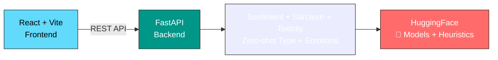
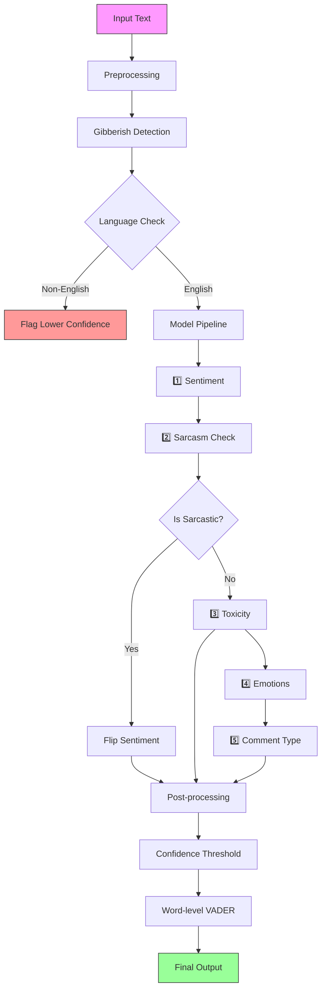

<div align="center">

# ⚡ Smart Comment Classification

### AI-powered comment analysis with a multi-model NLP pipeline

<br />

[](https://huggingface.co/)
[](https://react.dev/)
[](https://fastapi.tiangolo.com/)
[](https://www.python.org/)
[](https://vite.dev/)

<br />

> **Drop a comment. Get the vibe. Instantly.** ✨

Classify comments into **Positive** / **Negative** / **Neutral** and enrich them with **type**, **toxicity**, **emotion**, and **sarcasm** signals using a production-oriented ensemble of Hugging Face models plus lightweight heuristics.

</div>

---

## ✨ Features

| | Feature | Description |
|---|---|---|
| ✍️ | Single Comment | Type or paste → instant sentiment + confidence |
| 📁 | Bulk Upload | Drag & drop `.csv`, `.txt`, `.xlsx` (10MB / 5,000 rows) |
| 📊 | Real-time Results | Animated cards with color-coded labels |
| 📋 | Batch Table | Paginated, searchable, filterable results |
| ⬇️ | CSV Export | One-click download of all classified results |
| 🔄 | Mode Toggle | Switch between text input & file upload |
| ⚡ | Blazing Fast | <200ms/comment on GPU, <2s on CPU |
| 🎨 | Dark Glassmorphism | Sleek, modern UI |
| 🧪 | Sentiment | Positive, Neutral, Negative with confidence |
| 📝 | Comment Type | Praise, Complaint, Question, Feedback, Spam |
| ☠️ | Toxicity | Scores abusive language 0–100% |
| 🎭 | Emotions | 28 fine-grained emotions |
| 😏 | Sarcasm | Catches ironic positivity |
| 🔍 | Word Highlighting | Color-coded words by sentiment |
| 📖 | Multi-sentence | Detects mixed sentiment |
| 🚫 | Gibberish Filter | Rejects keyboard mashing |
| 🗣️ | Informal English | Handles slang, emojis |

---

## 🏗️ Architecture



---

## 🛠️ Tech Stack

| Layer | Technologies |
|:---:|:---|
| 🖥️ Frontend | React 19 · Vite 8 · Axios · Recharts · Framer Motion |
| ⚙️ Backend | FastAPI · Python 3.11 · Uvicorn |
| 🧠 ML/AI | RoBERTa · BERT · BART MNLI · GoEmotions · VADER · HuggingFace Transformers · PyTorch |
| 📄 File Parsing | PapaParse · SheetJS · pandas |

---

## 🤖 Models

| Model | Task | Params |
|:---|:---:|:---:|
| `cardiffnlp/twitter-roberta-base-sentiment-latest` | Sentiment | 125M |
| `unitary/toxic-bert` | Toxicity | 110M |
| `facebook/bart-large-mnli` | Comment Type | 400M |
| `SamLowe/roberta-base-go_emotions` | Emotions | 125M |
| `cardiffnlp/twitter-roberta-base-irony` | Sarcasm | 125M |
| VADER Lexicon | Word Sentiment | Rule-based |

> 📦 First run downloads multiple model weights from Hugging Face

---

## 🚀 Quick Start

### Prerequisites

- **Node.js** 18+
- **Python** 3.11+

### Backend

```bash
cd backend
python -m venv venv
# Windows: venv\Scripts\activate
# macOS/Linux: source venv/bin/activate
pip install -r requirements.txt
uvicorn main:app --reload
```

> 🖥️ Backend: http://localhost:8000  
> ⏱️ First startup: 2–5 minutes to load all 5 models

### Frontend

```bash
cd frontend
npm install
npm run dev
```

> 🌐 Frontend: http://localhost:5173

---

## 🔌 API Reference

| Method | Endpoint | Description |
|:---:|:---|:---|
| GET | /health | Health check + model info |
| POST | /classify/text | Classify single comment |
| POST | /classify/file | Upload file for batch |
| GET | /classify/status/{job_id} | Poll batch progress |

### Example Request

```bash
curl -X POST http://localhost:8000/classify/text \
  -H "Content-Type: application/json" \
  -d '{"text": "This product is amazing!"}'
```

### Example Response

```json
{
  "sentiment": "Positive",
  "sentiment_confidence": {
    "positive": 0.94,
    "neutral": 0.04,
    "negative": 0.02
  },
  "comment_type": "Praise",
  "toxicity": 0.001,
  "is_toxic": false,
  "is_sarcastic": false,
  "emotions": [{"label": "admiration", "score": 0.90}],
  "latency_ms": 83
}
```

> 📝 **Rate Limit:** 60 requests/minute | **Max Text:** 8,192 chars

---

## 📈 Performance

| Metric | Score |
|:---|:---:|
| 🎯 Accuracy | Not yet tracked by an automated eval suite |
| 📊 F1 Score | Not yet tracked by an automated eval suite |
| ⚡ Single Comment | Depends on which models are loaded and hardware |
| 📦 Bulk Processing | Batched in the backend as of v3.1 |

---

## ⚙️ How It Works



---

## 📂 Supported Files

| Format | Description |
|:---|:---|
| 📄 .txt | One comment per line |
| 📊 .csv | Auto-detects column; prompts if multi-column |
| 📗 .xlsx | Excel files |

> ⚠️ **Max file:** 10 MB | **Max rows:** 5,000

---

## Current Architecture

This project is **not** running ModernBERT in production today.

The live backend in `backend/main.py` currently uses:

- `cardiffnlp/twitter-roberta-base-sentiment-latest` for sentiment
- `cardiffnlp/twitter-roberta-base-irony` for sarcasm / irony
- `unitary/toxic-bert` for toxicity
- `SamLowe/roberta-base-go_emotions` for emotion tags
- `facebook/bart-large-mnli` for zero-shot comment type classification
- VADER for word-level lexical highlighting

Recent hardening work added:

- Tokenizer-aware truncation instead of raw character slicing
- Explicit model-load status and degraded health reporting
- Real backend batching for file jobs
- Regression tests for preprocessing, truncation, sarcasm, and batching
- Stage-level telemetry and heuristic/truncation metadata in responses

## ModernBERT Support

ModernBERT is now supported as the **preferred sentiment backend** when you provide a fine-tuned checkpoint path or Hugging Face repo through the `MODERNBERT_SENTIMENT_MODEL` environment variable.

Example:

```bash
set MODERNBERT_SENTIMENT_MODEL=your-org/modernbert-comment-sentiment
```

Important:

- The repo still does **not** contain a fine-tuned ModernBERT sentiment model by default.
- If `MODERNBERT_SENTIMENT_MODEL` is missing or fails to load, the backend falls back to `cardiffnlp/twitter-roberta-base-sentiment-latest`.
- The app UI and `/health` endpoint now expose which sentiment backend is actually active.
- A training scaffold for producing that checkpoint now lives in `backend/training/train_modernbert_sentiment.py`.
- The training script can now pull `cardiffnlp/tweet_eval` directly from Hugging Face for a fast public-data training path.
- Full setup instructions live in `docs/MODERNBERT_SETUP.md`.

## 📁 Project Structure

```
scc/
├── frontend/
│   ├── src/
│   │   ├── components/     # NavBar, TextInput, FileUpload...
│   │   ├── App.jsx         # Main app shell
│   │   └── main.jsx        # Entry point
│   └── package.json
├── backend/
│   ├── main.py             # API routes + ML pipeline
│   └── requirements.txt
└── docs/
    ├── HOW_IT_WORKS.md
    └── PRD.md
```

---

## 📜 License

<div align="center">

Made with ❤️ and caffeine — March 2026

---

**Powered by ModernBERT · Built with React + FastAPI**

</div>
